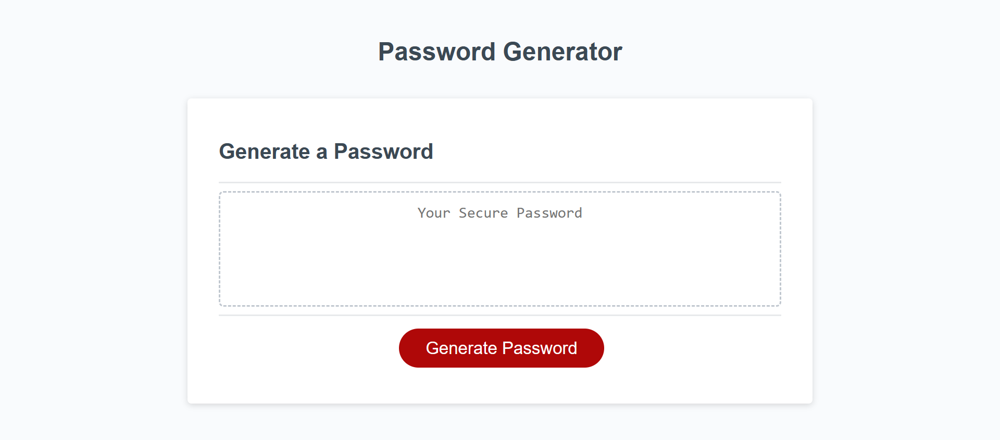
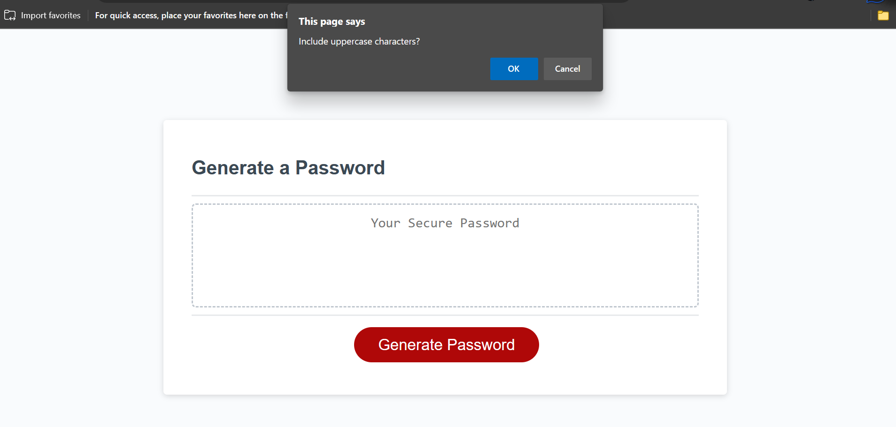

# bootcamp-third-challenge
Modifying code to make a password generator.

Has an event listener to generate button.

When Generate button is clicked the user is presented with multiple prompts asking for...
-Password Length
-Whether the user would like a number or not
-Whether the user would like a upper case letter or not
-Whether the user would like a lower case letter or not
-Whether the user would like a special character or not

After all prompts are completed the user will recieve a randomly generated password with all prompt answers taken into account.

